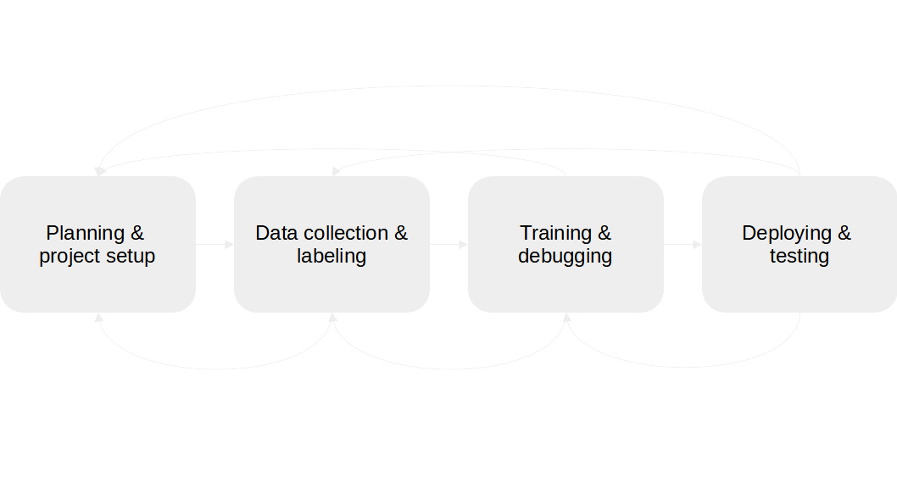
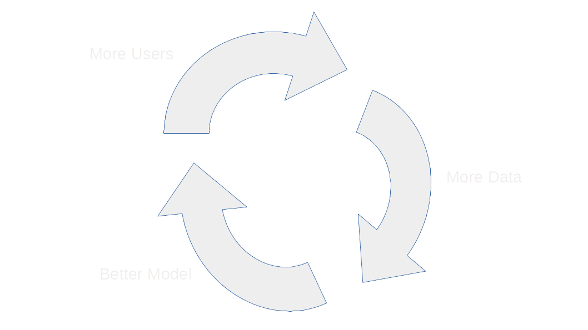

#
Setting up a Machine Learning project

## Before we start coding

### It always starts with the business needs

<q cite="https://venturebeat.com/2020/12/16/the-future-of-ai-deployments-reaching-production-is-bright-in-2021/">
Most AI projects fail. About 80% never reach deployment [...] and those that do are only profitable about 60% of the time. 
</q> (Wilson Pang, 2020: [venturebeat.com](https://venturebeat.com/2020/12/16/the-future-of-ai-deployments-reaching-production-is-bright-in-2021/))

These numbers paint a grim picture, especially considering that it calls into question the value added by AI Engineers. Therefore, to minimize the likelihood of such failure, **it is up to us** to set realistic expectations with stakeholders right from the start. After all, most AI projects fail because of at least one of the following problems:

- The project is poorly scoped
- The desired solution is not technically feasible
- The leap into production does not succeed
- Success criteria are not defined

Throughout this module, we will address all of these challenges. 

First, however, we must agree on the following premise: We AI Engineers are service providers; we should always consider the needs of the user first. So our raison d'être is to solve problems, not to use the most interesting and advanced algorithms possible. The latter only serves our intellectual satisfaction, not the business.

To gain an initial overview of the project requirements, the following three-step process is useful (Goku Mohandas, 2021: [madewithml.com](https://madewithml.com/courses/mlops/solution/)):

1. Visualize the ideal solution, i.e. how would the problem be solved if there were no constraints?
2. Learn how the problem is currently being solved.
3. Frame the solution you can provide. This includes factoring in the following points:
    - Automation or augmentation: Will you replace or support the user? Once trust in the solution grows, one can extend the augmentation solution to an automation.
    - User Experience constraints: To whom is the product made available? How does this relate to privacy concerns? How personalized does the solution need to be?
    - Technical constraints: What data is available? How much time is granted for development? How performant should the system be? How interpretable must the predictions be? What prediction latency can be tolerated?

**A little interlude**: All ideas and illustrations in the following four sections are recreated from Lecture 5 of the UC Berkeley Spring 2021 course '*Full Stack Deep Learning*' (Karayev, Tobin, and Abdeel, 2021: [fullstackdeeplearning.com](https://fullstackdeeplearning.com/spring2021/lecture-5/)).

### The Machine Learning lifecycle

Developing Machine Learning solutions is not a linear process. Nevertheless, a number of sub-processes can be identified that come with their own challenges. The sequence suggested here can be broken by falling back to previous steps.

1. Planning & project setup: 
    - Specify the requirements and the goals
    - Allocate project resources
2. Data collection & labeling:
    - Collect training instances (historical cases or via sensors)
    - In case of supervised learning: annotate with ground truth
3. Training & debugging:
    - Produce baseline model (often rule-based/deterministic)
    - Find state-of-the-art model(s) and reproduce it (or them)
    - Iterate on the baseline model given your experiments
4. Deploying & testing:
    - Write tests to prevent regressions
    - Evaluate for biases
    - Roll out in production

As mentioned above, one may revert to previous steps. Reasons for this may be, for example, the following:

- You realize obtaining the necessary data is too hard or labeling a different task is easier. 
- You realize the number of data points is insufficient or the data is of poor quality.
- You realize that the modeling task is too hard given the requirements and resources.
- You realize there is a mismatch between training data and data seen in deployment.

### Prioritizing projects

Agrawal, Gans, and Goldfarb describe what makes AI economically viable in their book '*Prediction Machines: The Simple Economics of Artificial Intelligence*' (2018): 

- AI reduces the cost of generating predictions.
- Predictions inform decision makers.
- If the predictions are reliable enough and the subsequent decision can be technically automated, then the AI can make decisions itself. 
- If predictions are cheap, it means they are scalable and can enable decisions that were not possible before (such as in the case of Uber: recruit a driver). 

The implication from this is that Machine Learning projects should be prioritized that, on the one hand, allow cheap predictions and, on the other hand, have a large business impact. This gives rise to the two dimensions to be considered: The business impact and feasibility (e.g. cost).

In order to come up with high-impact Machine Learning projects, consider the following questions:

1. Where can you take advantage of cheap prediction?
2. Where can you automate complicated processes?
3. What are other people/businesses doing?

For assessing the feasibility of Machine Learning for a given problem scenario, consider the following points:

1. Are you sure you need Machine Learning at all?
2. Carefully define success criteria with all stakeholders
3. Consider the ethics and data privacy concerns related to the usage of Machine Learning
4. Do a literature review
5. Try to rapidly collect a labeled benchmark dataset
6. Build a minimal viable product (MVP), potentially rule-based/deterministic
7. After all of these steps, are you still sure you need Machine Learning at all?

### Archetypes

While each Machine Learning project is unique, a few archetypes can be identified: Namely, **software 2.0**, **human-in-the-loop**, and **autonomous systems**. Each comes with a set of key questions to consider:

In the case of Software 2.0, we ideally want to create a data flywheel:

- **More Users**: Provides opportunity to automatically generate data and ideally have users label it themselves.
- **More data**: Provides opportunity for you as a machine learning engineer to improve models.
- **Better models**: Provides opportunity to improve the product, which in turn could recruit more users.

Another helpful way to think about the design of the project is to consult a product design guideline from successful organizations. For example, the following shows Apple's Human Interface Guidelines for Machine Learning Applications (Apple Inc., last retrieved Sep. 2021: [apple.com/design/human-interface-guidelines](https://developer.apple.com/design/human-interface-guidelines/machine-learning/overview/introduction/)):

1. What role does Machine Learning play in your application?
    - *Is this role critical or complementary*? The more critical the Machine Learning feature is, the more reliable the system needs to be.
    - *How sensitive is the data being used*? The more sensitive the data, the more serious are the consequences of inaccurate results.
    - *Is the feature proactive or reactive*, i.e. does the feature provide results without the user requesting it or does the user need to ask for it? Because people don't ask for the results that a proactive feature provides, they may have less tolerance for low-quality information.
    - *Is the feature visible or invisible*? Users will make a conscious decision of using the feature if it is visible and will be ignorant to its existence if it is invisble, e.g. a mobiles keyboard learning the user's typing behaviour and adjusting the tap area for each key to help them make fewer typing mistakes.
    - *Is the feature dynamic or static*? Some models improve dynamically, as people interact with the app, and others improve offline and will be updated when the app updates.

2. How can you learn from your users?
    - *Is the feedback explicit*? For instance, "suggest less pop music".
    - *Is the feedback implicit*? For instance, "I like this song".
    - *Is there calibration during setup*? For instance, the user might need to scan their face before they can use FaceID.
    - *Can the user suggest corrections*? 

3. How should your app handle mistakes?
    - *Does your app explain limitations*? That is, do you let your user know where you expect the model to perform well?
    - *Does your app allow corrections being made*? That is, do you let your user succeed even if the model fails?
    - *Does your app include attributions*? That is, does it help your user understand where the predictions come from?
    - *Does your app provide a confidence score/interval*? That is, does your app help the user gauge the quality of the results? 

### Metrics and baselines

## Git repositories

loooo Lorem ipsum dolor sit amet, consetetur sadipscing elitr, sed diam nonumy eirmod tempor invidunt ut labore et dolore magna aliquyam erat, sed diam voluptua. At vero eos et accusam et justo duo dolores et ea rebum. Stet clita kasd gubergren, no sea takimata sanctus est Lorem ipsum dolor sit amet. Lorem ipsum dolor sit amet, consetetur sadipscing elitr, sed diam nonumy eirmod tempor invidunt ut labore et dolore magna aliquyam erat, sed diam voluptua. At vero eos et accusam et justo duo dolores et ea rebum. Stet clita kasd gubergren, no sea takimata sanctus est Lorem ipsum dolor sit amet.

## Conda environments

Lorem ipsum dolor sit amet, consetetur sadipscing elitr, sed diam nonumy eirmod tempor invidunt ut labore et dolore magna aliquyam erat, sed diam voluptua. At vero eos et accusam et justo duo dolores et ea rebum. Stet clita kasd gubergren, no sea takimata sanctus est Lorem ipsum dolor sit amet. Lorem ipsum dolor sit amet, consetetur sadipscing elitr, sed diam nonumy eirmod tempor invidunt ut labore et dolore magna aliquyam erat, sed diam voluptua. At vero eos et accusam et justo duo dolores et ea rebum. Stet clita kasd gubergren, no sea takimata sanctus est Lorem ipsum dolor sit amet.

## Setting up documentation

Lorem ipsum dolor sit amet, consetetur sadipscing elitr, sed diam nonumy eirmod tempor invidunt ut labore et dolore magna aliquyam erat, sed diam voluptua. At vero eos et accusam et justo duo dolores et ea rebum. Stet clita kasd gubergren, no sea takimata sanctus est Lorem ipsum dolor sit amet. Lorem ipsum dolor sit amet, consetetur sadipscing elitr, sed diam nonumy eirmod tempor invidunt ut labore et dolore magna aliquyam erat, sed diam voluptua. At vero eos et accusam et justo duo dolores et ea rebum. Stet clita kasd gubergren, no sea takimata sanctus est Lorem ipsum dolor sit amet.